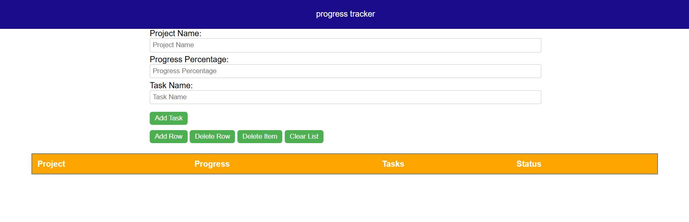
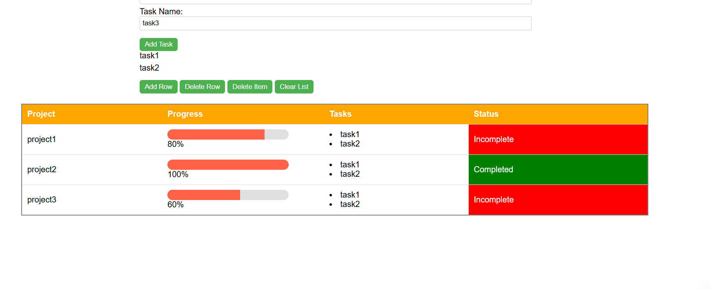
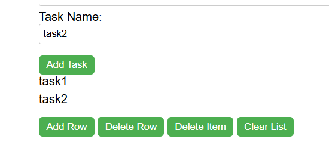

# 📊 Project Progress Tracker

A simple and interactive web application built with **HTML**, **CSS**, and **JavaScript** to track project progress with visual indicators and task management.

---

## ✨ Features

- ✅ Input project name, task list, and progress percentage.
- 📋 Dynamically add tasks to a project.
- 📈 Visual progress bar reflecting completion percentage.
- ✅ Status indicator showing "Completed" or "Incomplete".
- ➕ Add or remove project entries in a summary table.
- 🧹 Clear task list or delete specific tasks as needed.

---

## 📷 Screenshots

### 🔹 Main UI


### 🔹 Project Added with Progress Bar


### 🔹 Task List and Actions


> 💡 Store screenshots in a `screenshots/` folder at the root of your repository.

---

## 🛠️ Technologies Used

- HTML5
- CSS3
- JavaScript (Vanilla)

---

## 🚀 How to Use

1. Clone the repository:
   ```bash
   git clone https://github.com/your-username/Project-Progress-Tracker-HTML-CSS-JS.git
   cd Project-Progress-Tracker-HTML-CSS-JS
